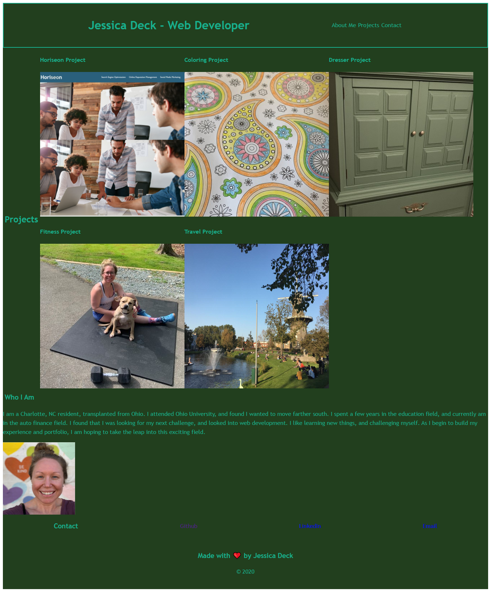

# Homework-2-2020-Portfolio

## Portfolio snapshot assignment

I undertook this project to take the chance to showcase our HTML and CSS knowledge thus far and display a sample of my work in the web development field. I was also working to achieve a responsive site based on the size of the screen being viewed from, so images and content would not overflow the container, or page. I included my contact information with working links, links to projects (or placeholders in this case), and links within the header that would take you to the appropriate section within the page. Flexbox provides the stylings for the entire CSS linked page.

## Installation

This project can be viewed using any web browser from the link provided.

[Jessica Deck's Portfolio](https://deck-jessica.github.io/Portfolio2020JMD/)

## Usage 

This page can be accessed and utilized to find more information about my experience in the web development field, my background, and a snapshot of my projects thus far. Only one link (the big Horiseon one) is my own work, the rest of the project images and links are placeholders for work to come!

## Credits

I used [GitHub Markdown](https://guides.github.com/features/mastering-markdown/) to create this ReadMe file, my Bootcamp course materials, and some minor help from my classmates and LAs. 

## License

MIT License

Copyright (c) [2020] [Jessica Deck]

Permission is hereby granted, free of charge, to any person obtaining a copy
of this software and associated documentation files (the "Software"), to deal
in the Software without restriction, including without limitation the rights
to use, copy, modify, merge, publish, distribute, sublicense, and/or sell
copies of the Software, and to permit persons to whom the Software is
furnished to do so, subject to the following conditions:

The above copyright notice and this permission notice shall be included in all
copies or substantial portions of the Software.

THE SOFTWARE IS PROVIDED "AS IS", WITHOUT WARRANTY OF ANY KIND, EXPRESS OR
IMPLIED, INCLUDING BUT NOT LIMITED TO THE WARRANTIES OF MERCHANTABILITY,
FITNESS FOR A PARTICULAR PURPOSE AND NONINFRINGEMENT. IN NO EVENT SHALL THE
AUTHORS OR COPYRIGHT HOLDERS BE LIABLE FOR ANY CLAIM, DAMAGES OR OTHER
LIABILITY, WHETHER IN AN ACTION OF CONTRACT, TORT OR OTHERWISE, ARISING FROM,
OUT OF OR IN CONNECTION WITH THE SOFTWARE OR THE USE OR OTHER DEALINGS IN THE
SOFTWARE.

---
